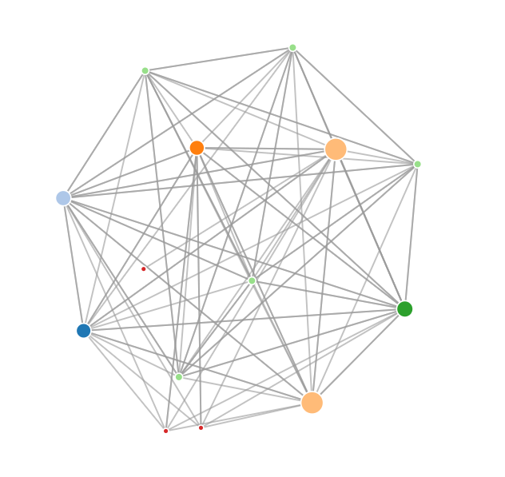

<body>
    <H1>What is this?</H1>
     
    
This is my cornerstone project for Univeristy of Michigan. This can be found in the courses honors track.

    
Professor: Dr. Charles 'Chuck' Severance

    
Class: Python for Everybody

    
Refrence:

    

        Coursera: <a href="https://www.coursera.org/specializations/python">Python UM</a>
         
        Dr. Chuck's Website: <a href="https://www.dr-chuck.com">www.dr-chuck.com</a>
         
        Free Python Materials: <a href="https://www.py4e.com/">Python for Everybody</a>
         
         
        Websites used for research:
         
        <a href="http://python-data.dr-chuck.net/">Dr. Chucks Projects Website</a>
         
        <a href="https://www.google.com">Google.com</a>
    

    

        
Description:
            This project was made utilizing Dr. Chucks files provided in his course. Spider.py was handmade.
        

         
        

            Utilization:
        <ol>
            <li>Install all dependencies within the provided filelock.</li>
            <li>Run spider.py.</li>
            
Spider.py

            <ul>
                <li>
                    Requests via command line:
                     
                    - URL to be spidered
                     
                    - Enable exception list
                     
                    - Exceptions list text file (Example of exception: https://www.google.com/search...  skips all google urls with google.com/search)
                     
                    - Enable saving of settings for easy setup
                     
                    - When restarted it will ask if you want to use a new url of provided an updated exceptions list text file
                </li>
                <li>
                    Crawls the designated URL adding newly found urls to a spider.sqlite DB (auto creates the DB)
                </li>
                <li>
                    Crawls the next url in the sqlite DB 
                </li>
                <li>
                    Records html (if found), error code(if provided), and the number of attempts on the site(if unable to access with a max of 3 attempts)
                </li>
            </ul>
            <li>Run sprank.py</li>
            
sprank.py

            <ul>
                <li>
                    Requests via command line:
                 
                    - Amount of iterations to calculate the ranking of the URLs collected so far(must be visited by the crawler, not just collected)
                </li>
                <li>Cylces through visited sites and ranks them based upon all other visited sites in the spider.sqlite DB</li>
                <li>Addds the ranking to the "rank' colomn</li>
            </ul>
            <li>Run spjson.py</li>
            
spjson.py

            <ul>
                <li>Pulls the ranking and url from the DB</li>
                <li>Creates spider/js for the force.html to utilize for the nodes</li>
            </ul>
            <li>Open force.html in browser/web engine</li>
        </ol>
        

    

    

        

        
         
        
         
        

        
Note: If you are doing the same class/project, please make your own graph and crawl the web. The pictures provided above are for showing what the code dose and not for
            use for grades, research, etc. 
        

    

</body>
